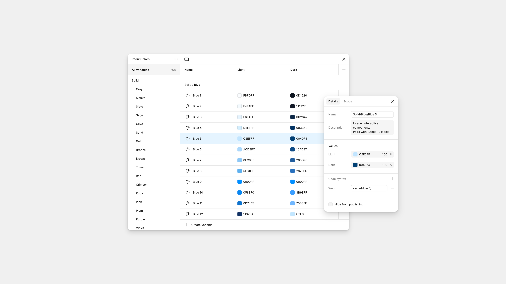
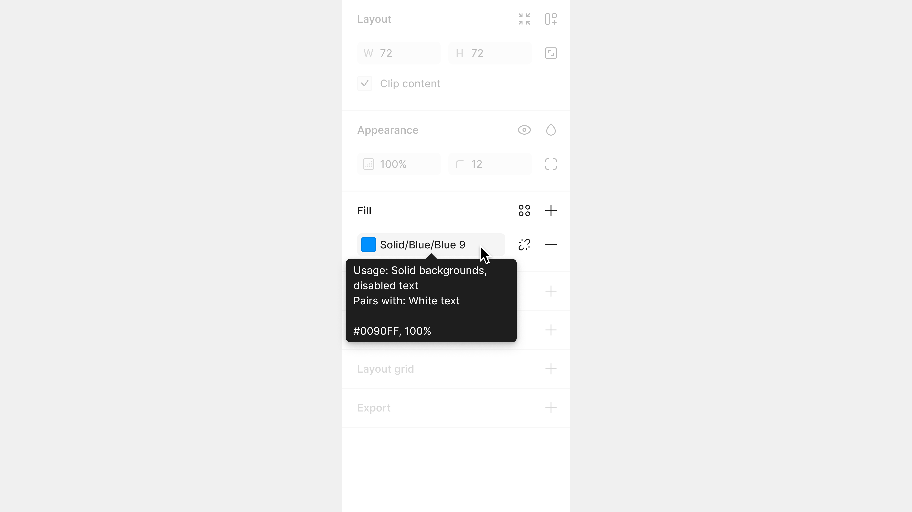
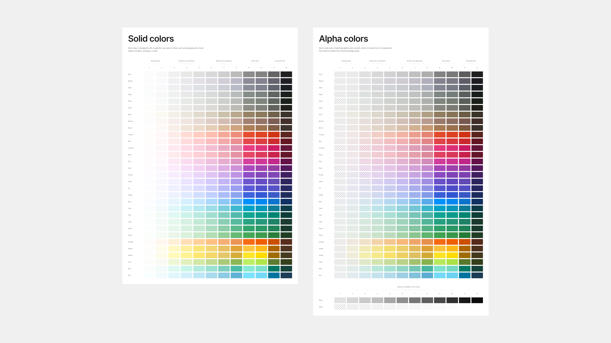
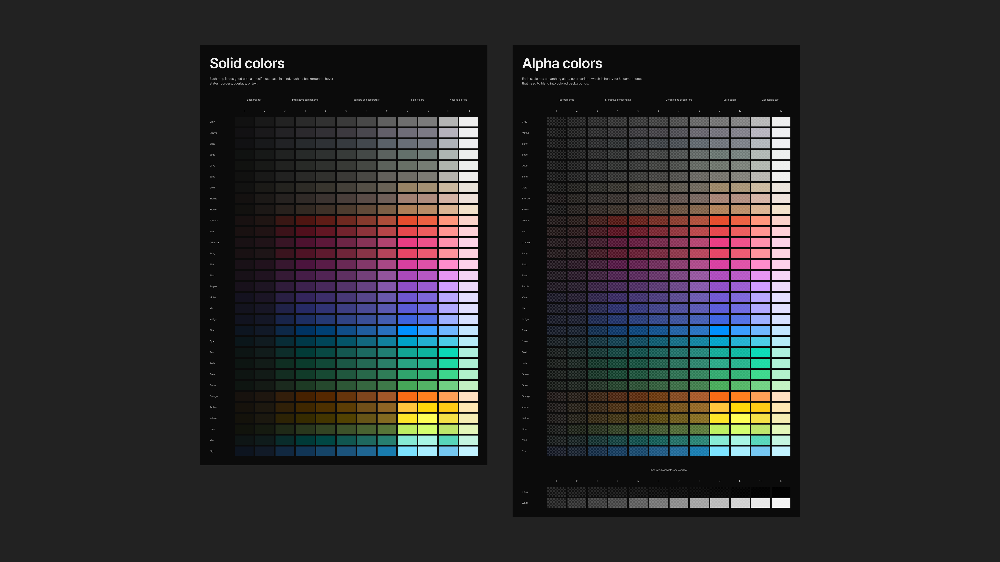

# Radix colors to Figma variables

A single-purpose utility plugin I created to convert [Radix colors](https://github.com/radix-ui/colors/tree/main/src) to Figma variables. 

The plugin runs once without any UI and creates a variable collection with all colors, and then renders 4 color sample sheets (solid and alpha colors, light and dark modes). 

The plugin is dead simple and doesn't handle edge cases, so the following is assumed:

- The user has a Figma Pro subscription (or higher) in order to create variables in two modes
- There is no variable collection named "Radix Colors" already present in the file

## Preview

### Variable collection


### Fill section


### Light mode colors


### Dark mode colors


## Quickstart

This plugin was created with [Plugma](https://github.com/gavinmcfarland/plugma).

### Requirements

- [Node.js](https://nodejs.org/en)
- [Figma desktop app](https://www.figma.com/downloads/)

### Install and Import

1. Install the dependencies and watch for changes while developing:

   ```bash
   npm install
   npm run dev
   ```

2. Open the Figma desktop app and import the plugin:

   - Open a file in Figma.
   - Search for "Import plugin from manifest..." using the [Quick Actions](https://help.figma.com/hc/en-us/articles/360040328653-Use-shortcuts-and-quick-actions#Use_quick_actions) bar.
   - Choose the `manifest.json` file from the `dist` folder.

3. Manage `manifest` details from inside `package.json`.

### Advanced

See the [Plugma docs](https://plugma.dev/docs) for further information.
